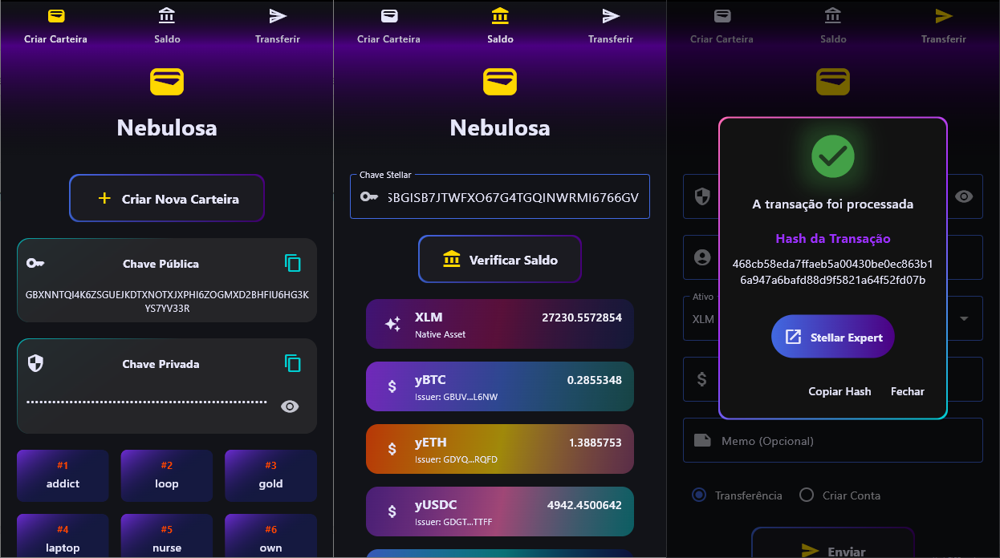

# 🌌 Nebulosa

Nebulosa é uma carteira para a rede Stellar blockchain, desenvolvida em Python. Este projeto foi desenvolvido como um estudo paralelo durante o desafio da NearX, com o objetivo de aprofundar conhecimentos em desenvolvimento blockchain, Python e interfaces gráficas.



## ✨ Funcionalidades

- Criação de novas contas Stellar
- Consulta de saldo de qualquer carteira usando chave pública
- Realização de transações entre contas
- Ativação de novas contas através de transferência inicial (requisito mínimo de 1 XLM)
- Interface gráfica amigável e intuitiva

## 🛠️ Tecnologias Utilizadas

- Python
- Flet (Interface Gráfica)
- Stellar SDK (Interação com blockchain)

## 📋 Pré-requisitos

```bash
python >= 3.8
flet
stellar-sdk
```

## 🚀 Instalação

1. Clone o repositório
```bash
git clone https://github.com/gastyr/nebulosa.git
```

2. Instale as dependências
```bash
pip install -r requirements.txt
```

3. Inicie o projeto
```bash
flet run wallet_app     
```

## 💻 Como Usar

1. Execute o programa principal:
```bash
flet run wallet_app
```

2. Para criar uma nova conta:
   - Clique em "Criar Nova Conta"
   - Guarde com segurança suas chaves pública, privada e mnemonic
   - Transfira pelo menos 1 XLM para ativar a conta

3. Para consultar saldo:
   - Insira a chave pública da conta
   - Clique em "Verificar Saldo"

4. Para realizar transferências:
   - Insira a chave privada da conta de origem
   - Insira a chave pública do destinatário
   - Digite o valor a ser transferido
   - Confirme a transação

## ⚠️ Importante

- Mantenha suas chaves privadas em segurança
- Nunca compartilhe sua chave privada
- Sempre verifique os endereços antes de realizar transferências
- É necessário manter um mínimo de 1 XLM na conta para mantê-la ativa

## 🤝 Contribuições

Contribuições são bem-vindas! Sinta-se à vontade para:
- Reportar bugs
- Sugerir novas funcionalidades
- Enviar pull requests

## 📝 Licença

Este projeto está sob a licença MIT - veja o arquivo [LICENSE](LICENSE) para detalhes.

## 📬 Contato

Se você tiver alguma dúvida ou sugestão, por favor, abra uma issue no repositório.

---

⭐ Desenvolvido como projeto de estudo paralelo ao desafio da NearX